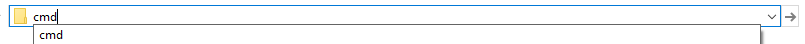

# delete_tool.py

A command line tool for deleting multiple files/directories.

<details>
  <summary>Why is this useful?</summary>

Sometimes you have multiple files that you want to remove, but they are scattered across many directories or you have a directory with many files and you want to clean it.
One example is ```__pycache__``` directories which you need to remove sometimes, but they are scattered across a big project.

This tool was created to make this cleaning easier.
</details>

## How to use the tool.
Assuming you've done the set up described in the root of the project.

Go to the directory where your files are located and open command line by typing cmd in the line where path to the directory is displayed and pressing Enter key:



In command line type: delete_tool.py \<regexp\> [-r] [-d]
- delete_tool.py is a name of the script and should always come first
- instead of \<regexp\> you need to provide a regular expression by which your files/directories will be filtered out. To learn more about regular expression syntax go to [Python documentation](https://docs.python.org/3.7/library/re.html#regular-expression-syntax)

Optional arguments:
- directories (-d): script will look only for directories; by default script searches only for files and ignores directories
- recursive (-r): script will look for files recursively in each directory it encounters on its way. For directories this is default behavior, for files default behavior is to search only current directory.
