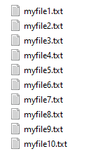
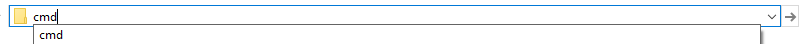
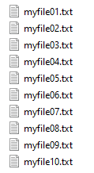

# pad_counters.py

A command line tool to pad counters in the names of multiple files in a directory.

<details>
  <summary>Why is this useful?</summary>

Often when you work with a list of files in a directory, you want to be able to sort them.
If you have a list like this:
```python
filenames = [file1.txt, file2.txt,..., file10.txt]
```
you would want them to be in the same order after sorting, but if you try you'll get this:
```python
print(sorted(filenames))
[file1.txt, file10.txt, file2.txt,..., file9.txt]
```
this is not what you want to happen.
That's why it's better to have your counters padded with zeros:
```python
filenames = [file01.txt, file02.txt,..., file10.txt]
print(sorted(filenames))
[file01.txt, file02.txt, file03.txt,..., file10.txt]
```

This tool was created to make it easier to pad counters of multiple files with the same base name.
</details>

## How to use the tool.
Assuming you've done the set up described in the root of the project.

Go to the directory where your files are located:



open command line by typing cmd in the line where path to the directory is displayed and pressing Enter key:



In command line type: pad_counters.py . myfile{}



Let's look at the structure of that command:
- pad_counters.py is the name of the script
- . (dot) means the path to the current location, you can also specify absolute or relative path here, but most of the time it's easier to just run cmd in the directory where your files are located and run the script with a dot for path
- myfile{} is a template which is used to detect counter in the filenames
    - the place where counter is located is marked by '{}'
    - template shouldn't contain extension and should match filename exactly
    - if filename contains spaces, the whole name should be surrounded by double quotes, e.g. "my photo {} summer 2019"

Those are three components (arguments) that are required to run the script. There are also some optional arguments:
```
pad_counters.py . myfile{} -e txt
```
- extension: if specified, script will change only files with that extension
```
pad_counters.py . myfile{} -p 3
```
- pad: if specified, counters will be padded to that width; by default padding is calculated automatically
```
pad_counters.py . myfile{} -v
```
- verbose: if present in arguments, verbose output will be displayed to the console showing the files which names were changed

Optional arguments can be specified in any order, but the name of a script should always come first:
```
pad_counters.py -v -e txt . myfile{} -p 3
```
