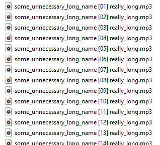
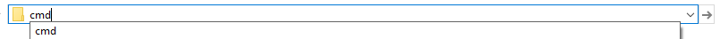

# rename_files.py

A command line tool to rename multiple similar files in a directory.

  
Why is this useful?

Sometimes you have a huge list of files (e.g. podcasts, photos) with the names you don't like. This tool allows you to change the names of the files easily.

## How to use the tool.
Assuming you've done the set up described in the root of the project.

> :warning: **before you start:** the intended use of the script is renaming all files in a directory or all files that have the same extension.

Go to the directory where your files are located:

open command line by typing cmd in the line where path to the directory is displayed and pressing Enter key:

In command line type: rename_files.py . -p podcast_episode_ -e mp3

Structure of the command:
- rename_files.py is the name of the script
- . (dot) means the path to the current location, you can also specify absolute or relative path here, but most of the time it's easier to just run cmd in the directory where your files are located and run the script with a dot for path
- prefix (-p) and/or suffix (-s) for new name should be specified. Prefix is the part before counter, suffix is the part after it. If prefix or suffix conteins spaces, it should be surrounded by double quotes.

Optional arguments:
- extension (-e): if specified, script will change only files with that extension; it is recommended to always specify extension, just in case
- first (-f): if specified, counters will start from that number, default is 1
- template (-t): template that is used to detect filenames to be renamed
    - the place where counter is located is marked by '{}'
    - template shouldn't contain extension and should match filename exactly
    - if filename contains spaces, the whole name should be surrounded by double quotes, e.g. "my photo {} summer 2019"
- padding (--pad): if specified, counters in filenames will be padded to that width, default is 2
- verbose(-v): if present in arguments, verbose output will be displayed to the console showing the files which names were changed
